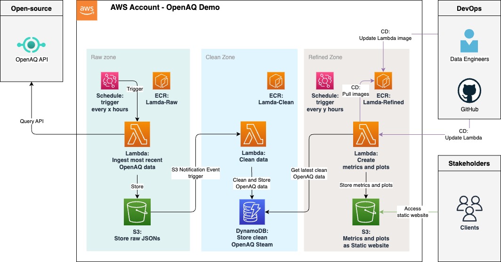
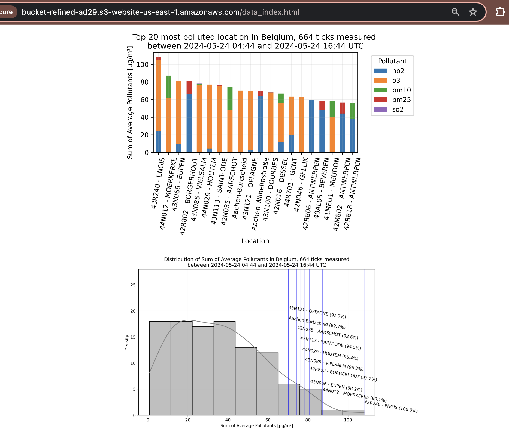
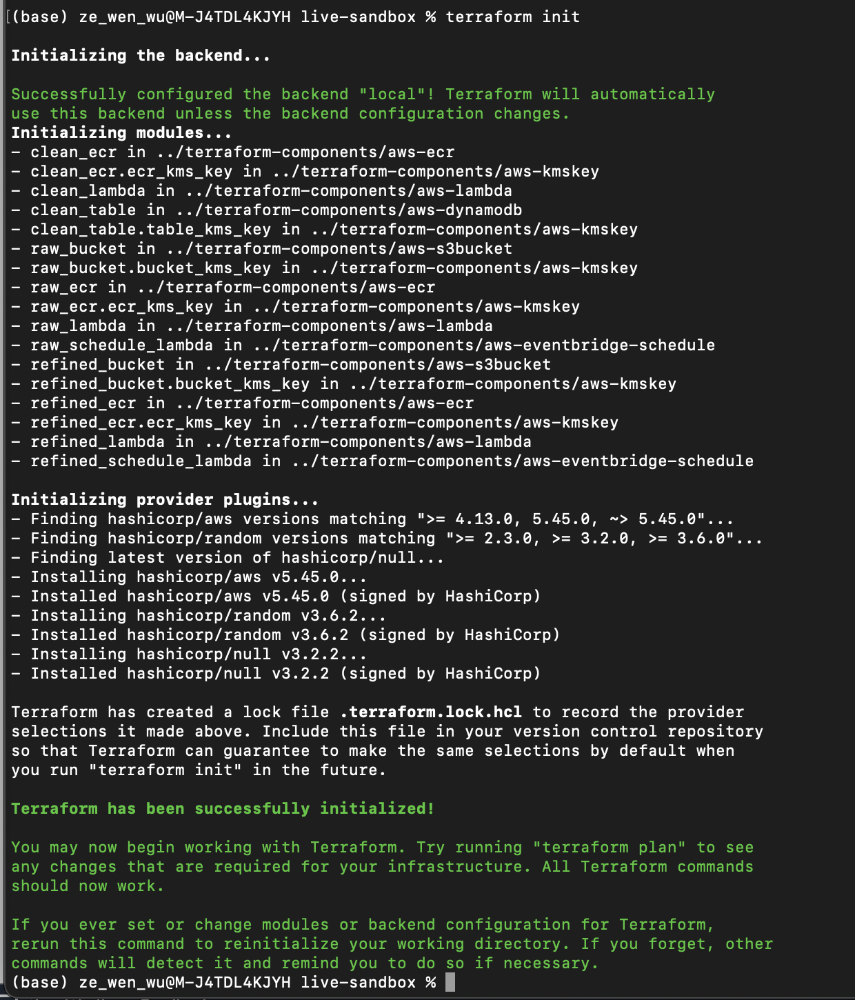
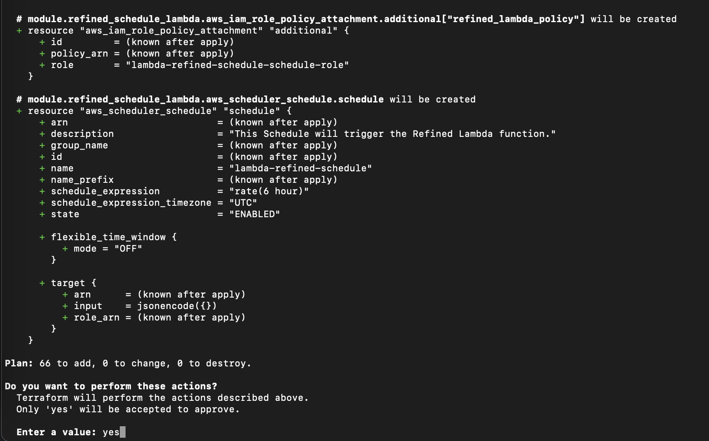
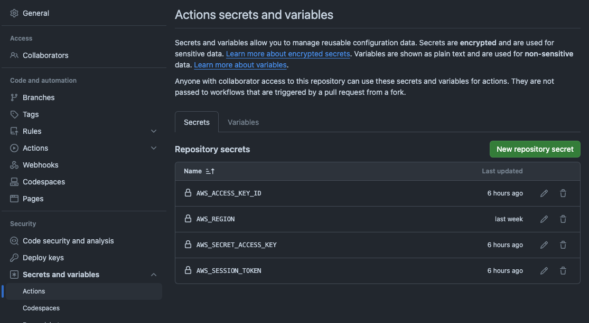
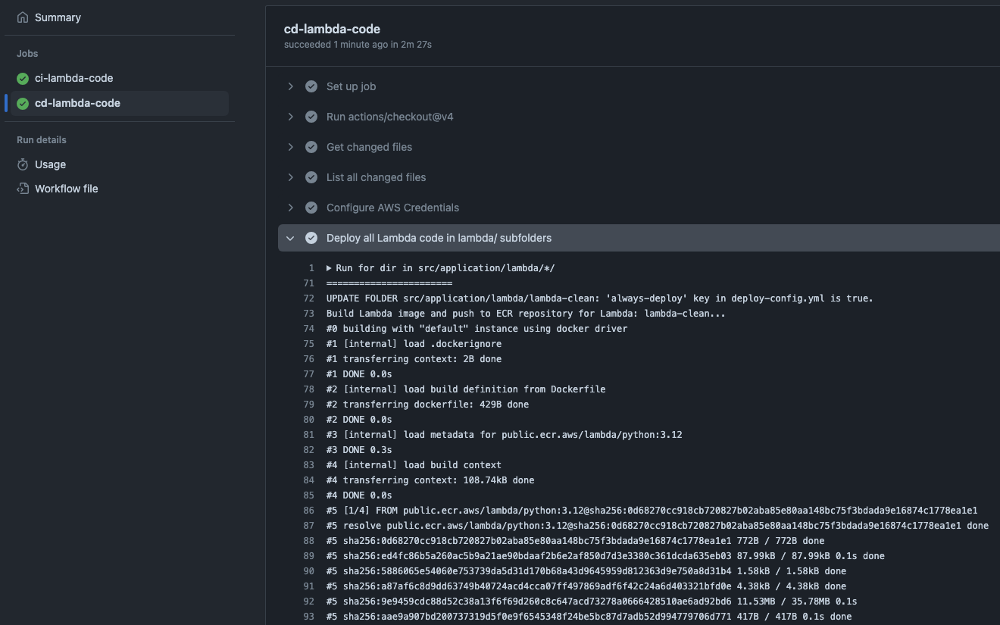
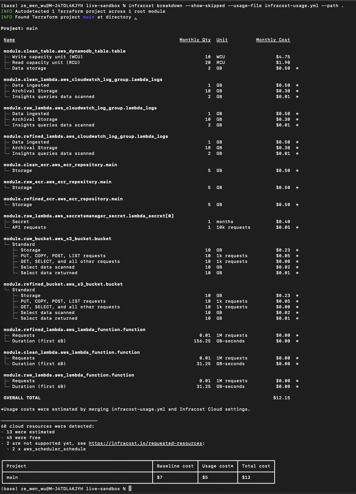
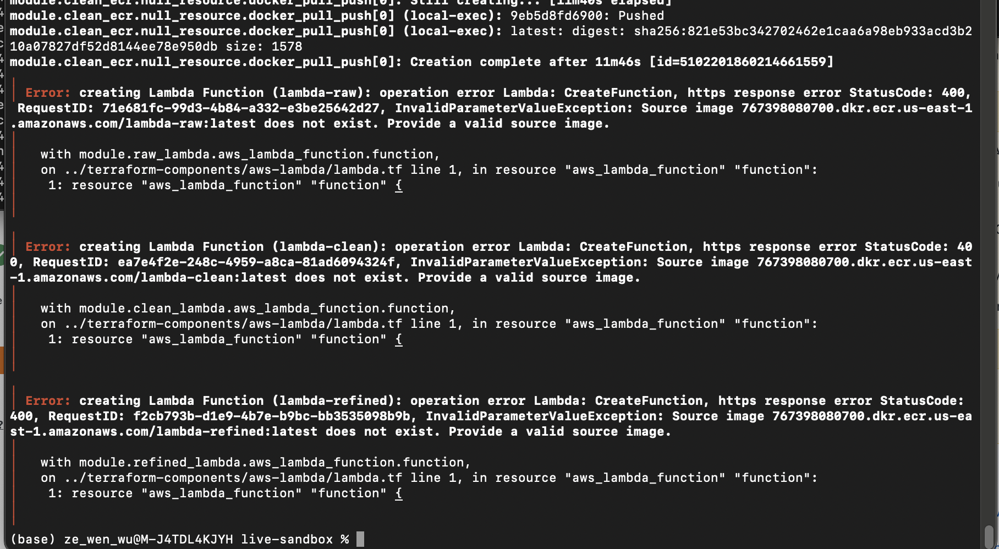

# OpenAQ DEMO: AWS Serverless Data Streaming Platform for Measuring Live Air Quality in Belgium

## Introduction



This repository contains a live streaming DEMO solution architecture and Python data pipelines to ingest, process, and visualize streaming data from the OpenAQ API. The solution architecture is built on AWS and uses the AWS services displayed in the diagram above.




We used Amazon Lambda functions to ingest and process streaming data live from the OpenAQ API. The final refined data and visualisarions are stored in Amazon S3 and hosted as a public static website. The static website are several HTML pages that displays the latest air quality data measured in Belgium from the OpenAQ API.

The following sections describe:
- **Terraform Blueprints/Components**: Our Terraform automation templates to deploy the solution architecture.
- **GitHub Action CI/CD Lambda Pipeline**: Our GitHub Actions CI/CD pipeline to deploy Lambda functions to AWS.
- **Tutorial**: Step-by-step guide to deploy the solution architecture using Terraform and GitHub Actions CI/CD pipeline.
- **Cost Estimation**: Cost estimation of the solution architecture using Infracost.
- **Troubleshooting**: Common issues and resolutions during the deployment of the solution architecture.

## Terraform Blueprints/Components

We use Terraform to automatically deploy the solution architecture. The Terraform blueprints are located in the `src/platform/live-sandbox` folder. **The Terraform blueprints are Terraform use-case specific files that references Terraform components.** For our use case, we are defining Terraform blueprints to deploy a end-to-end solution architecture for Ingesting, processing, and visualizing streaming data from OpenAQ API.

Terraform components are located in the `src/platform/terraform-components` folder. **The Terraform components are reusable Terraform code that can be used to deploy a specific AWS resource.** Terraform components not only deploys its specific AWS resource, but deploys them considering best practices regarding reusability, security, and scalability.

For more info on Terraform, please refer to the [Terraform documentation](https://www.terraform.io/docs/language/index.html).

## GitHub Action CI/CD Lambda Pipeline

We use GitHub Actions to implement a CI/CD pipeline for integrating and deploying Lambda functions. The GitHub Actions workflow is located in the `.github/workflows` folder. The GitHub Actions workflow is triggered at each push on any branch in the repository.

The GitHub Actions workflow contains the following steps:
- **ci-lambda-code**: This step runs linting tests on the Lambda application code located in the `src/application` folder, using Black, Flake8, and ISort.
- **cd-lambda-code** (depends on ci-lambda-code): This step builds the Docker image for the Lambda functions and deploys it to AWS Lambda. Deployment configuration files are located in the `src/application/lambda/lambda-<zone>/deploy-config.yml`, and specify the Lambda function to update and ECR repository name to upload the Docker image to. By default, the deployment is triggered only when the Lambda application code, located in their respective folders changes.

## Tutorial

Please follow the below tutorials to deploy the solution architecture using Terraform and GitHub Actions CI/CD pipeline:

1. Set up Terraform with AWS Cloud account
2. Deploy our AWS infrastructure and Lambda pipelines

### 1. Set up Terraform with AWS Cloud account

The following tools are required to deploy the solution architecture using Terraform. Please ensure you have the following tools available on your local machine:

- [OpenAQ API key](https://docs.openaq.org/docs/getting-started): You need to have an OpenAQ API key to access the OpenAQ API. The OpenAQ API key is used in the Lambda functions to ingest and process streaming data from the OpenAQ API.
- [AWS account](https://aws.amazon.com/): You need to have an AWS account to deploy resources on AWS.
- [Terraform](https://learn.hashicorp.com/tutorials/terraform/install-cli): You need to have Terraform installed on your local machine to deploy the Terraform blueprints.
- [Docker](https://docs.docker.com/get-docker/): You need to have Docker installed on your local machine to build and push Docker images to Amazon ECR, using Terrform.
- [AWS CLI](https://docs.aws.amazon.com/cli/latest/userguide/cli-chap-install.html): Optional, You need to have the AWS CLI installed on your local machine for viewing and updating AWS resources programmatically.

Follow the below steps to configure local Terraform with your AWS account:

**Step 1.** Configure Terraform to use your AWS access key, secret key, and session token by copy-pasting your AWS access and secret key in a Terminal:

```bash
export AWS_ACCESS_KEY_ID="xxx"
export AWS_SECRET_ACCESS_KEY="xxx"
export AWS_SESSION_TOKEN="xxx"
```

**Step 2.** Change directory to `live-sandbox` that contains Terraform blueprints. Setup up and validate the Terraform blueprints by running the below commands:

```bash
cd src/platform/live-sandbox
terraform init
terraform validate
```



> **Remark:** In a multi-engineer environment, it is recommended to store Terraform state files in a remote backend, such as AWS S3, to allow multiple engineers to work on the same Terraform codebase. For more info on Terraform backends, please refer to the [Terraform documentation](https://www.terraform.io/docs/language/settings/backends/index.html).

### 2. Deploy our AWS infrastructure and Lambda pipelines

#### Terraform

To deploy above solution architecture using Terraform,

**Step 1.** Adjust the Terraform file `src/platform/live-sandbox/meta.tf` to reference your OpenAQ API key in plain text:

```terraform
locals {
  openaq_api_key_file_path = "../../../data/01_raw/openaq-api-key.txt"
  
  tags = {
    Organisation = "DemoOrg"
    Department   = "DataEngineering"
    Environement = "Sandbox"
    Management   = "Terraform"
  }
}
```

**Step 2.** Change directory to `live-sandbox` that contains Terraform blueprints to deploy the solution architecture by running the below commands:

```bash
cd src/platform/live-sandbox
terraform apply
```

**Step 3.** Confirm the Terraform resources to deploy in your AWS account, confirm by typing `yes` in the Terminal.



#### GitHub Actions CI/CD Lambda Pipeline

Once the Terraform apply is successful, build and deploy the Lambda functions the first time using the GitHub Actions CI/CD pipeline,

**Step 4.** In GitHub, navigate to the repository and click on the `Settings` tab to add the following secrets to the repository to allow GitHub Actions to deploy the Lambda functions to your AWS account:



**Step 5.** Change the three files in the `src/application/lambda/lambda-<zone>/deploy-config.yml` to set `always-deploy` to `true`:

```yaml
cd-deploy:
  enabled: true
  always-deploy: true <-- CHANGE HERE
  lambda-name: lambda-<zone>
  ecr-repo-name: lambda-<zone>
  aws-region: us-east-1
```

**Step 5.** Push the changes to the your local clone repository to trigger the GitHub Actions CI/CD pipeline to build and deploy the Lambda functions. In GitHub, navigate to the repository and click on the `Actions` tab to view the GitHub Actions CI/CD pipeline:



> **Remark:** Remember to change the `always-deploy` to `false` after the first deployment to avoid unnecessary Lambda deployments at each commit.

#### Destroy the AWS infrastructure

To destroy the AWS infrastructure deployed using Terraform, run the below command:

```bash
terraform destroy
```

Confirm the Terraform resources to destroy in your AWS account, confirm by typing `yes` in the Terminal.

## Cost Estimation

The cost estimation of the solution architecture is based on the AWS services used in the solution architecture. The cost estimation is based using **Infracost**, a cost estimation tool that estimates the cost of Terraform resources before deployment.

To estimate the cost of the solution architecture before deployment, follow the below steps:

**Step 1.** Install Infracost and obtain an API key by following the instructions in the [Infracost documentation](https://www.infracost.io/docs/).

**Step 2.** Change directory to `live-sandbox` that contains Terraform blueprints. Run the below command to estimate the cost of the solution architecture:

```bash
cd src/platform/live-sandbox
infracost breakdown --show-skipped --usage-file infracost-usage.yml --path .
```

> **Remark**: The command uses the `infracost-usage.yml` file to estimate the usage costs of the solution architecture, which has been estimated carefully, but not guaranteed to be accurate.

The cost estimation of the solution architecture is displayed in the Terminal:




## Troubleshooting

If you encounter any issues during the deployment of the solution architecture, please refer to the below troubleshooting cases.

### creating Lambda function. image does not exist. Provide a valide source image.

During Terraform apply, you may encounter the below error message:



**Problem:** This error occurs when the Docker image for the Lambda function does not exist in the Amazon ECR repository. Even though, Terraform pushes a dummy Docker image to the Amazon ECR repository, this might take some time. Lambda functions might try to pull the Docker image from the Amazon ECR repository before the Docker image is pushed to the Amazon ECR repository. 

**Resolution:** Repeat Terraform apply again.