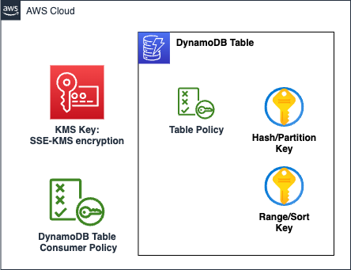

# AWS DynamoDB Table

Amazon DynamoDB is a fully managed, serverless, key-value and document database that delivers single-digit millisecond performance at any scale. It's a fully managed, multi-region, multi-active, durable database with built-in security, backup and restore, and in-memory caching for internet-scale applications.

This module creates:

- **DynamoDB table**
- **DynamoDB table policy**: Optional, Require that all content uploaded uses AWS KMS encryption and only our specific KMS BYOK key is used.
- **DynamoDB consumer policy**: This policy is created for the consumers of DynamoDB table. It can be directly attached to all the consumers which will give them required permissions to access this bucket. *We do not recommend consumers creating DynamoDB table access policy on their own*.
- **KMS key**: Optional, Server side encryption using KMS key. Users cannot put/update/delete data to DynamoDB without this KMS key, enforced using bucket policies.

## Architecture



## Implementation decisions

### SSE-KMS (Optional)

The bucket encryption can be enforced to use SSE-KMS. The KMS key is created together with the DynamoDB table.

### DynamoDB Table Policy (Optional)

Users are allowed to provide a custom bucket policy.

## How to use this module

```terraform
module "table" {
  source = "./local/path/to/this/module"

  table_name = "test-table"
  billing_mode_info = {
    mode           = "PROVISIONED"
    read_capacity  = 20
    write_capacity = 20
  }

  allowed_actions = [
    "dynamodb:PutItem",
    "dynamodb:GetItem",
    "dynamodb:UpdateItem",
    "dynamodb:DeleteItem",
    "dynamodb:Scan",
    "dynamodb:Query"
  ]

  deletion_protection_enabled = false

  hash_key_info = {
    name = "location"
    type = "S"
  }
  range_key_info = {
    name = "lastUpdated"
    type = "S"
  }
  ttl_attribute_name = "expireAt"

  apply_table_policy                    = false
  full_override_table_policy_document   = "{}"
  enable_kms_encryption                 = false
  table_kms_allow_additional_principals = []

  tags = local.tags
}
```

<!-- BEGIN_TF_DOCS -->
## Requirements

| Name | Version |
|------|---------|
| <a name="requirement_terraform"></a> [terraform](#requirement\_terraform) | >= 0.13 |
| <a name="requirement_aws"></a> [aws](#requirement\_aws) | = 5.45.0 |
| <a name="requirement_random"></a> [random](#requirement\_random) | >= 2.3.0 |

## Providers

| Name | Version |
|------|---------|
| <a name="provider_aws"></a> [aws](#provider\_aws) | = 5.45.0 |

## Modules

| Name | Source | Version |
|------|--------|---------|
| <a name="module_table_kms_key"></a> [table\_kms\_key](#module\_table\_kms\_key) | ../aws-kmskey | n/a |

## Resources

| Name | Type |
|------|------|
| [aws_dynamodb_resource_policy.policy](https://registry.terraform.io/providers/hashicorp/aws/5.45.0/docs/resources/dynamodb_resource_policy) | resource |
| [aws_dynamodb_table.table](https://registry.terraform.io/providers/hashicorp/aws/5.45.0/docs/resources/dynamodb_table) | resource |
| [aws_iam_policy.consumer](https://registry.terraform.io/providers/hashicorp/aws/5.45.0/docs/resources/iam_policy) | resource |
| [aws_caller_identity.main](https://registry.terraform.io/providers/hashicorp/aws/5.45.0/docs/data-sources/caller_identity) | data source |
| [aws_iam_policy_document.consumer](https://registry.terraform.io/providers/hashicorp/aws/5.45.0/docs/data-sources/iam_policy_document) | data source |
| [aws_region.active](https://registry.terraform.io/providers/hashicorp/aws/5.45.0/docs/data-sources/region) | data source |

## Inputs

| Name | Description | Type | Default | Required |
|------|-------------|------|---------|:--------:|
| <a name="input_allowed_actions"></a> [allowed\_actions](#input\_allowed\_actions) | List of DynamoDB actions which are allowed for same account principals for the consumer policy | `list(string)` | <pre>[<br>  "s3:GetObject",<br>  "s3:PutObject",<br>  "s3:ListBucket"<br>]</pre> | no |
| <a name="input_apply_table_policy"></a> [apply\_table\_policy](#input\_apply\_table\_policy) | Whether to apply pre-defined bucket policy. | `bool` | `true` | no |
| <a name="input_billing_mode_info"></a> [billing\_mode\_info](#input\_billing\_mode\_info) | Info block about the billing mode for the DynamoDB table. Mode can be PROVISIONED or PAY\_PER\_REQUEST. If mode is PROVISIONED, read\_capacity and write\_capacity should be provided. | `map(string)` | <pre>{<br>  "mode": "PROVISIONED",<br>  "read_capacity": 20,<br>  "write_capacity": 20<br>}</pre> | no |
| <a name="input_deletion_protection_enabled"></a> [deletion\_protection\_enabled](#input\_deletion\_protection\_enabled) | Whether to enable deletion protection on the DynamoDB table | `bool` | `false` | no |
| <a name="input_enable_kms_encryption"></a> [enable\_kms\_encryption](#input\_enable\_kms\_encryption) | Enable DynamoDB table encryption with KMS key? (true/false) | `bool` | `false` | no |
| <a name="input_full_override_table_policy_document"></a> [full\_override\_table\_policy\_document](#input\_full\_override\_table\_policy\_document) | [Optional] Bucket Policy JSON document. Bucket Policy Statements will be fully overriden | `string` | `"{}"` | no |
| <a name="input_hash_key_info"></a> [hash\_key\_info](#input\_hash\_key\_info) | Info block about attribute to use as the hash (partition) key and its type | `map(string)` | <pre>{<br>  "name": "id",<br>  "type": "S"<br>}</pre> | no |
| <a name="input_range_key_info"></a> [range\_key\_info](#input\_range\_key\_info) | Info block about attribute to use as the range (sort) key and its type | `map(string)` | <pre>{<br>  "name": "",<br>  "type": ""<br>}</pre> | no |
| <a name="input_table_kms_allow_additional_principals"></a> [table\_kms\_allow\_additional\_principals](#input\_table\_kms\_allow\_additional\_principals) | [Optional] Additional Table KMS Key Policy Principals. | `list(string)` | `[]` | no |
| <a name="input_table_name"></a> [table\_name](#input\_table\_name) | The name of the DynamoDB table | `string` | n/a | yes |
| <a name="input_tags"></a> [tags](#input\_tags) | Custom tags which can be passed on to the AWS resources. They should be key value pairs having distinct keys. | `map(any)` | `{}` | no |
| <a name="input_ttl_attribute_name"></a> [ttl\_attribute\_name](#input\_ttl\_attribute\_name) | The name of the attribute to use as the Time To Live (TTL) attribute | `string` | `""` | no |

## Outputs

| Name | Description |
|------|-------------|
| <a name="output_consumer_policy_arn"></a> [consumer\_policy\_arn](#output\_consumer\_policy\_arn) | The Amazon Resource Name (ARN) of the IAM policy for the consumer. |
| <a name="output_table_arn"></a> [table\_arn](#output\_table\_arn) | The Amazon Resource Name (ARN) of the table. |
| <a name="output_table_kms_key_arn"></a> [table\_kms\_key\_arn](#output\_table\_kms\_key\_arn) | The Amazon Resource Name (ARN) of the KMS key used for the DynamoDB table. |
| <a name="output_table_kms_key_id"></a> [table\_kms\_key\_id](#output\_table\_kms\_key\_id) | The ID of the KMS key used for the DynamoDB table. |
| <a name="output_table_name"></a> [table\_name](#output\_table\_name) | The name of the table. |
<!-- END_TF_DOCS -->