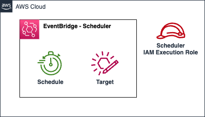

# AWS EventBridge Scheduler

Amazon EventBridge Scheduler is a serverless scheduler that allows you to create, run, and manage tasks from one central, managed service. Without the need to provision and manage infrastructure, or integrate with multiple services, EventBridge Scheduler provides you with the ability to deliver schedules at scale and reduce maintenance costs.

This module creates:

- **EventBridge Schedule**: Resource which creates a schedule that triggers a target at a specified time or interval.
- **Execution Role**: This role is created with the required policies to access resources within a VPC, X-Ray tracing, reading secrets from secret manager and logging in cloud watch.

## Architecture



## Implementation decisions

### IAM Execution Role
The execution role is created with the following policies:
- others: Additional policies that are provided by the user, which can be attached to the execution role.

## How to use this module

```terraform
module "schedule" {
  source = "./local/path/to/this/module"

  schedule_info = {
    name        = "my-schedule"
    state       = "ENABLED"
    description = "My test schedule."
    start_date  = null
    end_date    = null
  }
  schedule_group_name          = "default"
  schedule_expression          = "rate(2 hour)"
  schedule_expression_timezone = "UTC"

  schedule_policy_arns = {
    "raw_lambda_policy" = module.raw_lambda.lambda_consumer_policy_arn
  }

  target_info = {
    arn      = module.raw_lambda.lambda_info.arn
    role_arn = module.raw_lambda.lambda_consumer_policy_arn
    input    = {}
  }

  tags = local.tags
}
```

<!-- BEGIN_TF_DOCS -->
## Requirements

| Name | Version |
|------|---------|
| <a name="requirement_terraform"></a> [terraform](#requirement\_terraform) | >= 1.1.3 |
| <a name="requirement_aws"></a> [aws](#requirement\_aws) | >= 4.13.0 |

## Providers

| Name | Version |
|------|---------|
| <a name="provider_aws"></a> [aws](#provider\_aws) | >= 4.13.0 |

## Modules

No modules.

## Resources

| Name | Type |
|------|------|
| [aws_iam_role.schedule_role](https://registry.terraform.io/providers/hashicorp/aws/latest/docs/resources/iam_role) | resource |
| [aws_iam_role_policy_attachment.additional](https://registry.terraform.io/providers/hashicorp/aws/latest/docs/resources/iam_role_policy_attachment) | resource |
| [aws_scheduler_schedule.schedule](https://registry.terraform.io/providers/hashicorp/aws/latest/docs/resources/scheduler_schedule) | resource |
| [aws_iam_policy_document.schedule_role](https://registry.terraform.io/providers/hashicorp/aws/latest/docs/data-sources/iam_policy_document) | data source |

## Inputs

| Name | Description | Type | Default | Required |
|------|-------------|------|---------|:--------:|
| <a name="input_schedule_expression"></a> [schedule\_expression](#input\_schedule\_expression) | The schedule expression, which can be a rate-based, <br>cron-based, or one-time expression. | `string` | `"cron(0 0 * * ? *)"` | no |
| <a name="input_schedule_expression_timezone"></a> [schedule\_expression\_timezone](#input\_schedule\_expression\_timezone) | The timezone for the schedule expression. | `string` | `"UTC"` | no |
| <a name="input_schedule_group_name"></a> [schedule\_group\_name](#input\_schedule\_group\_name) | The name of the schedule group. This is used to group schedules together. | `string` | n/a | yes |
| <a name="input_schedule_info"></a> [schedule\_info](#input\_schedule\_info) | [Required] Object containing Schedule name and description. | <pre>object({<br>    name        = string<br>    state       = string<br>    description = string<br>    start_date  = string<br>    end_date    = string<br>  })</pre> | n/a | yes |
| <a name="input_schedule_policy_arns"></a> [schedule\_policy\_arns](#input\_schedule\_policy\_arns) | Policy ARNs to be attached to schedule execution role <br>that will be invoked for its target.<br>Map key is logical policy name and value is policy ARN. <br>e.g {<logical\_policy\_name>: <policyARN>} | `map(string)` | `{}` | no |
| <a name="input_tags"></a> [tags](#input\_tags) | Tags which can be passed on to the AWS resources. They should be key value pairs having distinct keys | `map(string)` | `{}` | no |
| <a name="input_target_info"></a> [target\_info](#input\_target\_info) | [Required] Object containing Target Arn, and an universal input. | <pre>object({<br>    arn      = string<br>    input    = map(string)<br>  })</pre> | n/a | yes |

## Outputs

| Name | Description |
|------|-------------|
| <a name="output_schedule_execution_role_arn"></a> [schedule\_execution\_role\_arn](#output\_schedule\_execution\_role\_arn) | The ARN of the Lambda Consumer Policy. |
| <a name="output_schedule_info"></a> [schedule\_info](#output\_schedule\_info) | The name and ARN of the schedule. |
<!-- END_TF_DOCS -->
