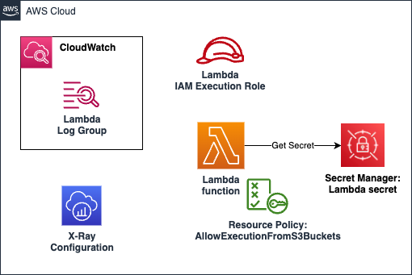

# AWS Lambda Function

AWS Lambda is an event-driven, serverless computing platform provided by Amazon as a part of Amazon Web Services. It is a computing service that runs code in response to events and automatically manages the computing resources required by that code.

This module creates:

- **Lambda function**: Lambda function with the given configuration.
- **Execution Role**: This role is created with the required policies to access resources within a VPC, X-Ray tracing, reading secrets from secret manager and logging in cloud watch.
- **Lambda Resource Policy**: Resource policy that grants permissions to any S3 bucket of the AWS account that owns the function to invoke it.
- **Cloud Watch Log Group**: For logging lambda executions in Amazon CloudWatch.
- **Secret Manager Secret**: Encrypted secret inside Secret Manager for storing given secrets and adds to lambda's environment variable for easy access of the secret.
- **X-ray configuration**: Optional, Enable X-ray tracing for the lambda function.
- **VPC Configuration**: Optional, Host lambda function inside VPC and assocaite with the given security groups and subnets.

## Architecture



## Implementation decisions

### Lambda Function deployment package options

In this module, the Lambda function supports three types of deployment packages:

- **Local Package**: The deployment package of the Lambda function is a local zip file.
- **S3 Package**: The deployment package of the Lambda function is available in an S3 bucket.
- **Docker Image**: The deployment package of the Lambda function refers to an Docker image URI, available in Amazon ECR.

### IAM Execution Role

The execution role is created with the following policies:
- base_policy: Permissions to write logs to CloudWatch, access resources within a VPC, X-Ray tracing, publish to a specified SNS topic or send message to a specified SQS queue.
- lambda_execution_secret: Reading the created lambda secret from secret manager.
- others: Additional policies that are provided by the user, which can be attached to the execution role.

### Lambda Resource Policy

In this module, all Lambda functions created have a resource policy that grants permissions to any S3 bucket of the AWS account that owns the function to invoke it. 

This policy grants the account the permissions that are required to invoke the function in the scenario of S3 Event Notifications Lambda triggers.

### Secrets Manager Secret

In this module, if secrets are provided by the users through the `secrets` variable, then the module creates a secret in the Secret Manager and this secret name and ARN are included as additional environment variables in the lambda function. 

The secret is encrypted using the default KMS key.

## How to use this module

```terraform

module "lambda" {
  source = "path/to/this/module/aws-lambda"

  function_name                  = "test-lambda"
  function_description           = "Test Lambda"
  reserved_concurrent_executions = -1
  timeout                        = 10
  memory                         = 128

  publish = true

  deploy_package_info = {
    type      = "docker"
    image_uri = "${module.clean_ecr.repository_url}:latest"
  }

  allowed_actions = [
    "lambda:GetFunction",
    "lambda:InvokeFunction",
    "lambda:ListVersionsByFunction",
  ]
  lambda_policy_arns = {
    "raw_bucket_consumer" = module.raw_bucket.consumer_policy_arn
  }

  environment_variables = {
    "DYNAMODB_TABLE_NAME" = module.clean_table.table_name
  }

  secrets = {}

  vpc_config = {
    vpc_subnet_ids         = []
    vpc_security_group_ids = []
  }

  tags = local.tags
}
```

<!-- BEGIN_TF_DOCS -->
## Requirements

| Name | Version |
|------|---------|
| <a name="requirement_terraform"></a> [terraform](#requirement\_terraform) | >= 1.1.3 |
| <a name="requirement_aws"></a> [aws](#requirement\_aws) | ~> 5.45.0 |
| <a name="requirement_random"></a> [random](#requirement\_random) | >= 3.6.0 |

## Providers

| Name | Version |
|------|---------|
| <a name="provider_aws"></a> [aws](#provider\_aws) | ~> 5.45.0 |
| <a name="provider_random"></a> [random](#provider\_random) | >= 3.6.0 |

## Modules

No modules.

## Resources

| Name | Type |
|------|------|
| [aws_cloudwatch_log_group.lambda_logs](https://registry.terraform.io/providers/hashicorp/aws/latest/docs/resources/cloudwatch_log_group) | resource |
| [aws_iam_policy.base_policy](https://registry.terraform.io/providers/hashicorp/aws/latest/docs/resources/iam_policy) | resource |
| [aws_iam_policy.consumer](https://registry.terraform.io/providers/hashicorp/aws/latest/docs/resources/iam_policy) | resource |
| [aws_iam_policy.lambda_execution_secret](https://registry.terraform.io/providers/hashicorp/aws/latest/docs/resources/iam_policy) | resource |
| [aws_iam_role.lambda_exec](https://registry.terraform.io/providers/hashicorp/aws/latest/docs/resources/iam_role) | resource |
| [aws_iam_role_policy_attachment.additional](https://registry.terraform.io/providers/hashicorp/aws/latest/docs/resources/iam_role_policy_attachment) | resource |
| [aws_iam_role_policy_attachment.base_policy](https://registry.terraform.io/providers/hashicorp/aws/latest/docs/resources/iam_role_policy_attachment) | resource |
| [aws_iam_role_policy_attachment.lambda_execution_secret](https://registry.terraform.io/providers/hashicorp/aws/latest/docs/resources/iam_role_policy_attachment) | resource |
| [aws_lambda_function.function](https://registry.terraform.io/providers/hashicorp/aws/latest/docs/resources/lambda_function) | resource |
| [aws_lambda_permission.allow_s3_buckets](https://registry.terraform.io/providers/hashicorp/aws/latest/docs/resources/lambda_permission) | resource |
| [aws_secretsmanager_secret.lambda_secret](https://registry.terraform.io/providers/hashicorp/aws/latest/docs/resources/secretsmanager_secret) | resource |
| [aws_secretsmanager_secret_version.lambda_secret](https://registry.terraform.io/providers/hashicorp/aws/latest/docs/resources/secretsmanager_secret_version) | resource |
| [random_string.secret_name_suffix](https://registry.terraform.io/providers/hashicorp/random/latest/docs/resources/string) | resource |
| [aws_caller_identity.active](https://registry.terraform.io/providers/hashicorp/aws/latest/docs/data-sources/caller_identity) | data source |
| [aws_iam_policy_document.base_policy](https://registry.terraform.io/providers/hashicorp/aws/latest/docs/data-sources/iam_policy_document) | data source |
| [aws_iam_policy_document.consumer](https://registry.terraform.io/providers/hashicorp/aws/latest/docs/data-sources/iam_policy_document) | data source |
| [aws_iam_policy_document.lambda_exec](https://registry.terraform.io/providers/hashicorp/aws/latest/docs/data-sources/iam_policy_document) | data source |
| [aws_iam_policy_document.lambda_execution_secret](https://registry.terraform.io/providers/hashicorp/aws/latest/docs/data-sources/iam_policy_document) | data source |
| [aws_region.active](https://registry.terraform.io/providers/hashicorp/aws/latest/docs/data-sources/region) | data source |

## Inputs

| Name | Description | Type | Default | Required |
|------|-------------|------|---------|:--------:|
| <a name="input_allowed_actions"></a> [allowed\_actions](#input\_allowed\_actions) | List of Lambda actions which are allowed <br>  for same account principals for the consumer policy | `list(string)` | <pre>[<br>  "lambda:GetFunction",<br>  "lambda:InvokeFunction",<br>  "lambda:ListVersionsByFunction"<br>]</pre> | no |
| <a name="input_dead_letter_config_arn"></a> [dead\_letter\_config\_arn](#input\_dead\_letter\_config\_arn) | (Optional) ARN of an SNS topic or SQS queue to notify when an invocation fails. | `string` | `""` | no |
| <a name="input_deploy_package_info"></a> [deploy\_package\_info](#input\_deploy\_package\_info) | Object containing information about the deployment package, which can be<br>either a absolute path of an existing zip-file containing source code,<br>an S3 path referencing an existing zip-file in S3,<br>or a Docker image uri referencing an exiting Docker image hosted in ECR. | <pre>object({<br>    type      = string<br>    file_path = optional(string)<br>    runtime   = optional(string)<br>    handler   = optional(string)<br>    s3_bucket = optional(string)<br>    s3_key    = optional(string)<br>    image_uri = optional(string)<br>  })</pre> | n/a | yes |
| <a name="input_environment_variables"></a> [environment\_variables](#input\_environment\_variables) | A map that defines environment variables for the Lambda Function. | `map(string)` | `{}` | no |
| <a name="input_function_description"></a> [function\_description](#input\_function\_description) | Lambda function description | `string` | n/a | yes |
| <a name="input_function_name"></a> [function\_name](#input\_function\_name) | Lambda function name | `string` | n/a | yes |
| <a name="input_lambda_policy_arns"></a> [lambda\_policy\_arns](#input\_lambda\_policy\_arns) | Policy ARNs to be attached to lambda execution role. <br>Map key is logical policy name and value is policy ARN. <br>e.g {<logical\_policy\_name>: <policyARN>} | `map(string)` | `{}` | no |
| <a name="input_memory"></a> [memory](#input\_memory) | Amount of memory(in MB) the Lambda Function can use at runtime. <br>A value from 128 MB to 3,008 MB, in 64 MB increments. | `number` | `128` | no |
| <a name="input_publish"></a> [publish](#input\_publish) | Whether to publish creation/change as new Lambda Function Version. | `bool` | `true` | no |
| <a name="input_reserved_concurrent_executions"></a> [reserved\_concurrent\_executions](#input\_reserved\_concurrent\_executions) | The amount of reserved concurrent executions for this Lambda Function. <br>A value of 0 disables Lambda Function from being triggered and <br>-1 removes any concurrency limitations. <br>Defaults to Unreserved Concurrency Limits -1. | `number` | `-1` | no |
| <a name="input_secrets"></a> [secrets](#input\_secrets) | Map of secret name(as reflected in Secrets Manager) <br>and secret JSON string for its value. | `map(string)` | `{}` | no |
| <a name="input_tags"></a> [tags](#input\_tags) | [Optional] Custom tags which can be passed on to the AWS resources. <br>They should be key value pairs having distinct keys | `map(string)` | `{}` | no |
| <a name="input_timeout"></a> [timeout](#input\_timeout) | The amount of time your Lambda Function has to run in seconds. | `number` | `10` | no |
| <a name="input_tracing_mode"></a> [tracing\_mode](#input\_tracing\_mode) | Tracing mode of the Lambda Function. <br>Valid value can be either PassThrough or Active. | `string` | `"Active"` | no |
| <a name="input_vpc_config"></a> [vpc\_config](#input\_vpc\_config) | Optional VPC config. Provide list of subnet\_ids and security\_group\_ids | <pre>object({<br>    vpc_subnet_ids         = list(string)<br>    vpc_security_group_ids = list(string)<br>  })</pre> | <pre>{<br>  "vpc_security_group_ids": [],<br>  "vpc_subnet_ids": []<br>}</pre> | no |

## Outputs

| Name | Description |
|------|-------------|
| <a name="output_lambda_consumer_policy_arn"></a> [lambda\_consumer\_policy\_arn](#output\_lambda\_consumer\_policy\_arn) | The ARN of the Lambda Consumer Policy. |
| <a name="output_lambda_info"></a> [lambda\_info](#output\_lambda\_info) | The name, ARN, invoke ARN, Version Number of the Lambda Function |
<!-- END_TF_DOCS -->